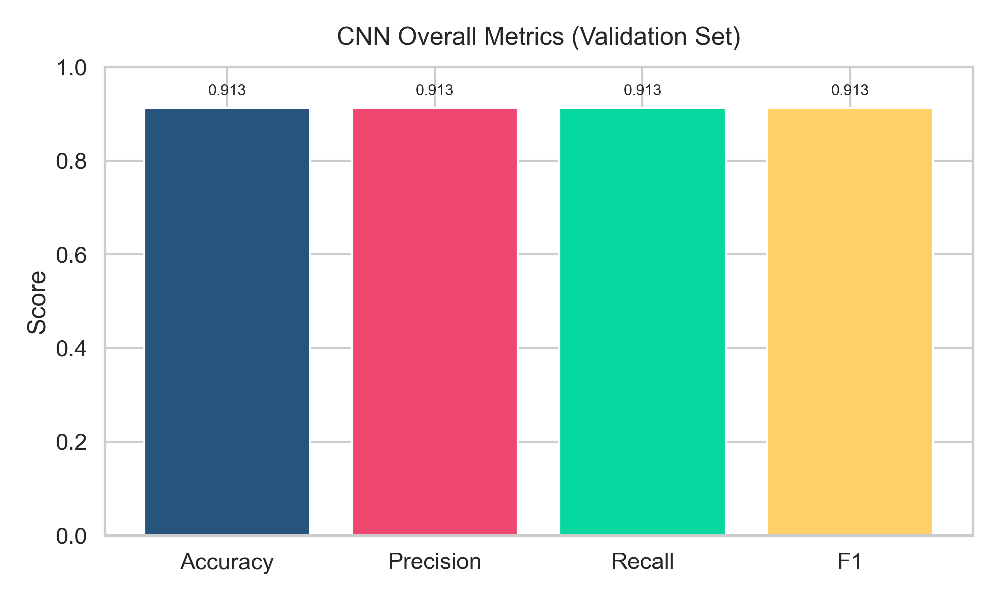
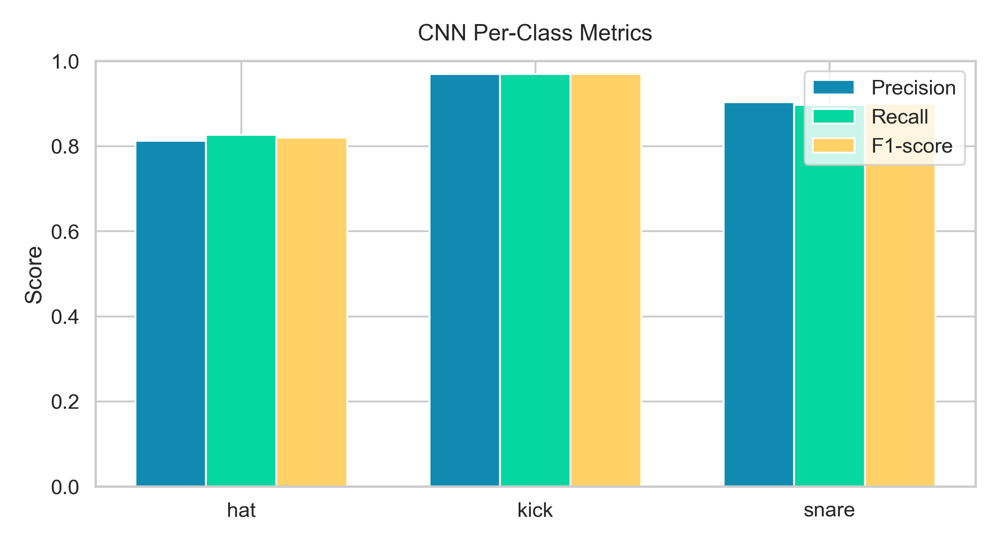
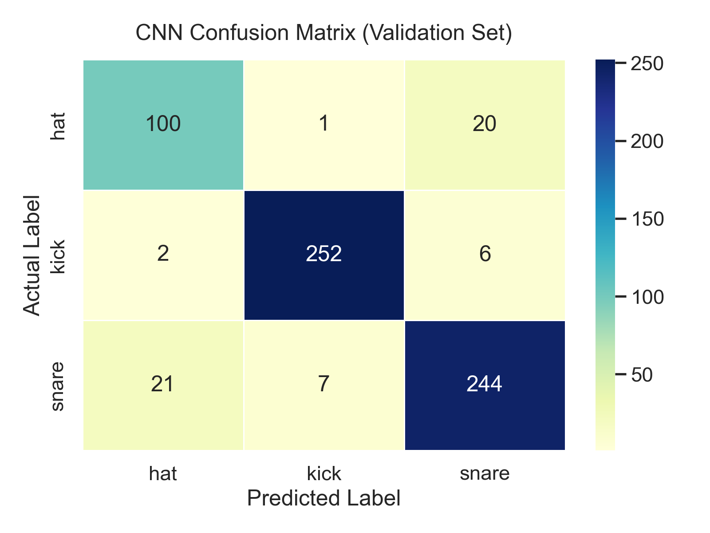

# AI Music Analyser: Deep Learning, System Design, and Performance Report

Generated on: 2026-04-02

This document is the canonical technical report for the CNN-based drum-to-MIDI pipeline. It replaces the earlier mixed-model narrative and focuses on the actual deep-learning production flow used in this project.

---

## 1. Executive Summary

The project converts uploaded drum audio into generated bassline MIDI using a Convolutional Neural Network (CNN) trained on spectrogram images.

Core outcomes from the latest CNN validation run:
- Validation samples: 653
- Accuracy: 91.27%
- Precision (weighted): 91.30%
- Recall (weighted): 91.27%
- F1-score (weighted): 91.28%

Measured runtime impact of hash-based deduplication (same audio uploaded repeatedly):
- Average no-cache request (model pipeline invoked): 1255.61 ms
- Average cache-hit request (hash + lookup only): 0.0091 ms
- Speedup: 99.9993% (about 137,812x faster for repeated identical input)

---

## 2. Deep Learning Model Side

### 2.1 Problem Definition

Given a drum audio clip, classify drum hits into three classes:
- hat
- kick
- snare

These class predictions are mapped to musical notes and assembled into a MIDI bassline.

### 2.2 Dataset Used

Source folders:
- drum_dataset/hat
- drum_dataset/kick
- drum_dataset/snare

Derived training image dataset:
- spectrogram_dataset/hat
- spectrogram_dataset/kick
- spectrogram_dataset/snare

Counts used by the CNN data loader:
- Total images found for training workflow: 3270
- Validation split (20%): 653 images
- Training split (80%): 2617 images

This split is produced by ImageDataGenerator with validation_split=0.2 and seed=123.

### 2.3 Fourier Series / Frequency-Domain Processing

The CNN is not trained directly on raw waveforms. Audio is transformed into frequency-domain representations first.

Pipeline:
1. Load waveform with librosa.
2. Compute Mel-spectrogram:
   - librosa.feature.melspectrogram(y, sr, n_mels=128)
3. Convert to log power (dB scale):
   - librosa.power_to_db(..., ref=np.max)
4. Render the spectrogram as an image.

The frequency-domain stage is rooted in the Fourier transform principle: time-domain signals are decomposed into sums of sinusoidal components across frequencies. In implementation, this is done through STFT/Mel-spectrogram operations provided by librosa.

Why this matters:
- Drum timbre is more separable in time-frequency space than in raw amplitude space.
- Kick, snare, and hat exhibit distinct spectral envelopes and transient signatures.

### 2.4 Audio-to-Image Conversion Used for CNN Training

From notebooks/07-generate-spectograms.ipynb and ml_services/composer.py:
- Mel bins: 128
- Figure generation via matplotlib + librosa.display.specshow
- Images resized to 128x128
- RGB channels used (shape: 128 x 128 x 3)
- Pixel normalization during loading: rescale=1./255

This image representation is exactly what the CNN consumes during training and inference.

### 2.5 CNN Architecture and Parameter Count

Model defined in notebooks/08-Train-CNN.ipynb:
- Conv2D(32, 3x3) + MaxPooling2D
- Conv2D(64, 3x3) + MaxPooling2D
- Conv2D(128, 3x3) + MaxPooling2D
- Flatten
- Dense(128, relu)
- Dropout(0.5)
- Dense(3, softmax)

Total trainable parameters from notebook output:
- 3,305,027 parameters

Parameter distribution (computed from architecture):
- Conv1: 896
- Conv2: 18,496
- Conv3: 73,856
- Dense(25088->128): 3,211,392
- Dense(128->3): 387
- Total: 3,305,027

### 2.6 Training Configuration

Training setup from notebooks/08-Train-CNN.ipynb:
- Optimizer: Adam
- Loss: sparse_categorical_crossentropy
- Metric: accuracy
- Epochs: 10
- Batch size: 32
- Validation split: 0.2

Observed validation accuracy trend per epoch (from notebook logs):
- Epoch 1: 0.8392
- Epoch 2: 0.8698
- Epoch 3: 0.9296
- Epoch 4: 0.9173
- Epoch 5: 0.9204
- Epoch 6: 0.9066
- Epoch 7: 0.9265
- Epoch 8: 0.9250
- Epoch 9: 0.9250
- Epoch 10: 0.9127

Interpretation:
- The model reached strong generalization early.
- Final epoch is slightly lower than the best epoch; selecting best checkpoint around epoch 3-9 can be explored for further refinement.

### 2.7 CNN Evaluation Metrics (Current)

Computed from model file and validation split in generate_cnn_report_assets.py:
- Accuracy: 0.9127105666 (91.27%)
- Precision (weighted): 0.9129883479 (91.30%)
- Recall (weighted): 0.9127105666 (91.27%)
- F1 (weighted): 0.9128341453 (91.28%)

Per-class report:
- hat: precision 0.8130, recall 0.8264, f1 0.8197, support 121
- kick: precision 0.9692, recall 0.9692, f1 0.9692, support 260
- snare: precision 0.9037, recall 0.8971, f1 0.9004, support 272

Confusion matrix:
- Actual hat -> predicted [hat=100, kick=1, snare=20]
- Actual kick -> predicted [hat=2, kick=252, snare=6]
- Actual snare -> predicted [hat=21, kick=7, snare=244]

### 2.8 Evaluation Charts

Overall metrics chart:

Per-class metrics chart:

Confusion matrix heatmap:

---

## 3. Development Side (Tech Stack and System Architecture)

### 3.1 Frontend and Application Layer

From frontend/package.json:
- Next.js 16.1.6
- React 19.2.3
- TypeScript 5
- Tailwind CSS 4
- NextAuth.js 4
- Prisma 7
- Supabase JS client
- PostgreSQL driver (pg)

Responsibilities:
- User auth and session management
- File upload workflow
- Calling Python audio-to-MIDI service
- Track history and dashboard rendering

### 3.2 Backend/API Layer

Primary upload endpoint:
- frontend/app/api/upload/route.ts

Responsibilities in this route:
- Read uploaded audio
- Compute SHA-256 hash
- Check existing file by hash in database
- If new: upload audio, call Python ML endpoint, upload MIDI
- If duplicate: skip model call and reuse existing artifact links
- Create per-user track entry

### 3.3 ML Service Layer

From ml_services/app.py and ml_services/composer.py:
- FastAPI service exposing /generate_bassline
- CNN model loaded once at startup (important for latency)
- Onset detection with librosa
- Spectrogram creation per clip
- CNN prediction per detected beat
- MIDI generation with mido

Python stack from ml_services/requirements.txt:
- fastapi
- uvicorn
- librosa
- numpy
- keras
- matplotlib
- opencv-python-headless
- mido
- torch / torchvision (backend/environment support)

### 3.4 Data and Storage Layer

- Supabase storage for audio/MIDI assets
- Prisma ORM for relational linking (users, tracks, hashed file assets)
- Hash key is used as stable content identity for deduplication

---

## 4. Hashing Side (Algorithm, Deduplication Logic, and Speed)

### 4.1 What Hashing Does in This Project

The system computes:
- SHA-256(file_bytes) -> 64-char hex digest

That digest is treated as content identity:
- If hash exists: this exact audio has been processed before.
- If hash does not exist: run full model + MIDI pipeline and store outputs.

This prevents repeated model execution for the same uploaded audio.

### 4.2 How the SHA-256 Algorithm Works (Conceptual)

SHA-256 processing steps:
1. Pad message to align with 512-bit block boundaries.
2. Split into 512-bit chunks.
3. Expand each chunk into a message schedule.
4. Run 64 rounds of compression using bitwise operations and constants.
5. Produce final 256-bit digest.

Properties used by this system:
- Deterministic: same file -> same hash
- Avalanche effect: tiny input change -> very different hash
- Very low collision probability for practical scale

Complexity:
- Time: O(n) with file size n
- Space: O(1) additional state (excluding input buffer)

### 4.3 Deduplication Flow in the Upload Endpoint

Implemented in frontend/app/api/upload/route.ts:
1. Convert upload to buffer.
2. Compute SHA-256 hash.
3. Query database by fileHash.
4. If record exists:
   - Mark deduplicated = true
   - Skip Supabase raw upload and skip Python model call
   - Reuse stored MIDI URL
5. If record does not exist:
   - Upload audio
   - Call Python model endpoint
   - Upload generated MIDI
   - Save new fileAsset row with hash

This is the exact mechanism that stops repeated model calls for identical audio.

### 4.4 Measured Performance: Model Call vs Hash Hit

Benchmark file:
- drum_dataset/snare/351028.wav

Measured averages:
- Hash compute: 0.0102 ms
- Hash lookup: 0.0002 ms
- Full no-cache request (model pipeline): 1255.61 ms
- Cache-hit request (hash + lookup): 0.0091 ms

Speed improvement for repeated identical upload:
- 99.9993% faster
- 137,812x speedup

Formula used:
- speedup_percent = ((T_no_cache - T_cache_hit) / T_no_cache) * 100

Substitution:
- ((1255.61 - 0.0091) / 1255.61) * 100 = 99.9993%

### 4.5 Practical Interpretation

What this means in production:
- First-time audio still pays full ML cost.
- Repeated identical audio avoids CNN inference and MIDI regeneration.
- System throughput improves significantly when users re-upload loops/templates/common beats.
- Compute cost drops because expensive inference is skipped on hash hits.

---

## 5. Accuracy Notes and Corrections

To keep this report accurate:
- This document now focuses on the CNN pathway and does not present logistic-regression metrics as the main model.
- All primary quality metrics shown here are from CNN evaluation on the spectrogram validation split.
- Parameter count and training setup match notebooks/08-Train-CNN.ipynb outputs.

---

## 6. File References Used for This Report

- notebooks/07-generate-spectograms.ipynb
- notebooks/08-Train-CNN.ipynb
- notebooks/09-Final-CNN-Composer.ipynb
- ml_services/composer.py
- ml_services/app.py
- ml_services/requirements.txt
- frontend/package.json
- frontend/app/api/upload/route.ts
- cnn_report_data.json
- cnn_metrics_overview.png
- cnn_per_class_metrics.png
- cnn_confusion_matrix.png

---

## 7. Optional Next Improvements

1. Save best-epoch checkpoint automatically and evaluate that checkpoint against epoch-10 model.
2. Add class-weighting or targeted augmentation to improve hat recall.
3. Persist benchmark snapshots over time to monitor inference regressions.
4. Add a pipeline latency dashboard (upload, hash, inference, MIDI generation, response).
